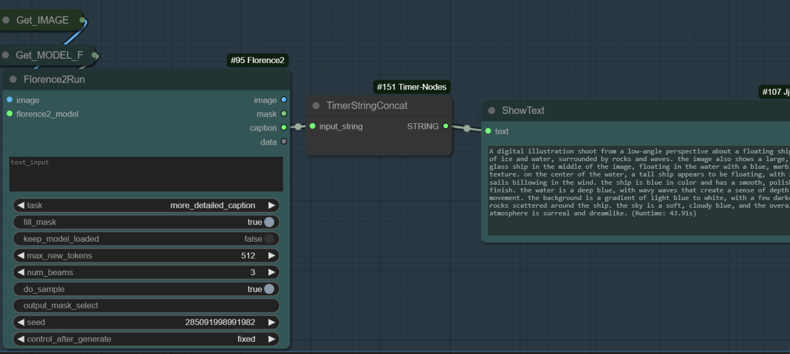

Timer Nodes for ComfyUI WIP

Summary

This project provides a set of custom timer nodes for ComfyUI. These nodes allow you to measure and append runtime information to strings or other data during your workflow. The functionality is particularly useful for debugging, performance monitoring, or annotating results with timing information.

Installation Guide

Locate the custom_nodes Directory
Find the custom_nodes directory within your ComfyUI installation. This is where custom nodes should be placed.

git clone <https://github.com/Shannooty/ComfyUI-Timer-Nodes>

Restart ComfyUI

Example Usage: 

Node List

1. TimerStart

Purpose: Restarts the global timer at the node position.

Inputs:

value (any): Data to pass through the node to act as the starting trigger.

Outputs:

The input value is passed through unchanged.

2. TimerStringConcat

Purpose: Appends the current runtime to a given string.

Inputs:

input_string (STRING): The string to annotate with runtime information.

Outputs:

STRING: The input string with appended runtime.
